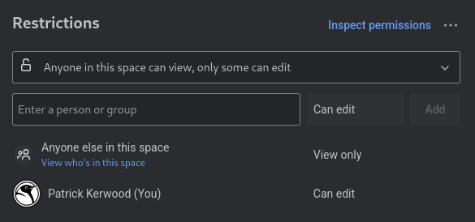
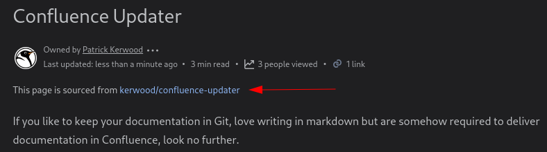
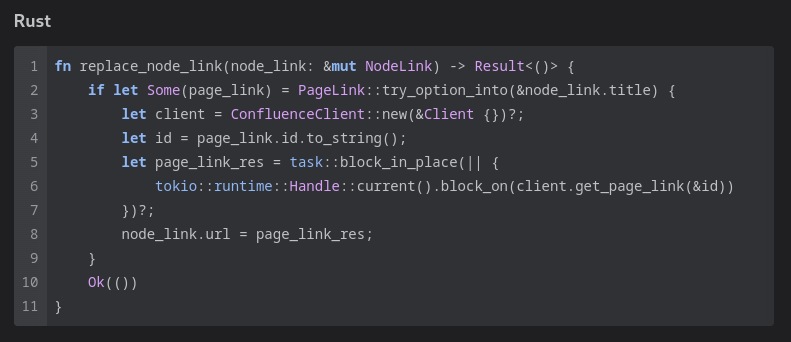
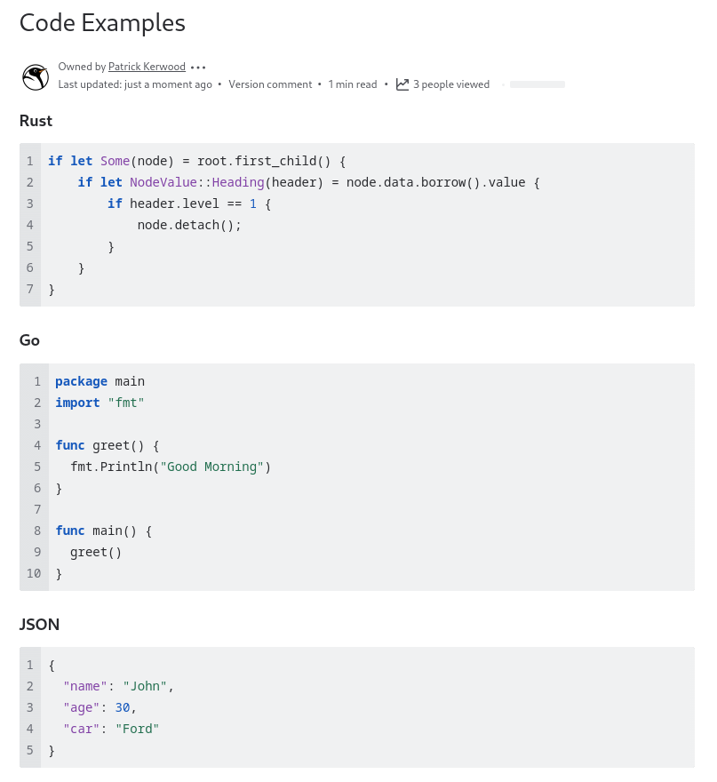

# Confluence Updater

[](https://www.rust-lang.org/)

If you like to keep your documentation in Git, love writing in markdown but are somehow required to deliver documentation in Confluence, look no further.

Confluence Updater will render your markdown files to HTML and upload it to a specific page in your Confluence Cloud instance. The tool will label each page with a SHA based on the page content. If the SHA hasn't changed since last update, the page will be skipped.

You can create a build pipeline that uploads your Git documentation to Confluence Cloud. Here's a how-to on my blog [https://linuxblog.xyz/posts/confluence-updater/](https://linuxblog.xyz/posts/confluence-updater/).

## Authentication
Confluence Cloud only supports personal access tokens. 
Go to [https://id.atlassian.com/manage-profile/security/api-tokens](https://id.atlassian.com/manage-profile/security/api-tokens) and create an API token.

Confluence Updater will add a label to all pages with the local part of the personal access token user email address. For example, a token with the email of `patrick@kerwood.dk` will get the label `pa-token:patrick` applied.
This makes it easy to locate all Confluence pages where a user's personal access token is being used if the user becomes invalid for any reason.

Additionally, by setting the `superscriptHeader` property in the configuration with a link to the repository, you can quickly find and replace the personal access token for that specific user, by searching for that specific label.

## Usage
The tool searches for a `confluence-updater.yaml` file in the current directory, which contains the configuration for which markdown files to render and the page ID to update with the content. An example configuration file is available in the repository. **Note:** You need to create the page manually in Confluence Cloud first and obtain its page ID to include in the configuration file.

Run below example command to start the process.

```
confluence-updater -u your-user@example.org -s <api-token> --fqdn https://your-domain.atlassian.net
```

You can use environment variables instead of parameters.

```sh
Render Markdown files and push them to Confluence Cloud pages.

Usage: confluence-updater [OPTIONS] --user <USER> --secret <SECRET>

Options:
  -u, --user <USER>                Confluence user to login with [env: CU_USER=]
  -s, --secret <SECRET>            The token/secret to use. https://id.atlassian.com/manage-profile/security/api-tokens [env: CU_SECRET=]
      --fqdn <FQDN>                The fully qualified domain name of your Atlassian Cloud. [env: CU_FQDN=]
  -c, --config-path <CONFIG_PATH>  The path to the config file. [env: CU_CONFIG_PATH=] [default: ./confluence-updater.yaml]
  -l, --label <label>              Add a label to all updating pages. Can be used multiple times.
      --log-level <LOG_LEVEL>      Log Level. [env: LOG_LEVEL=] [default: info] [possible values: trace, debug, info, warn, error]
  -h, --help                       Print help
  -V, --version                    Print version

Author: Patrick Kerwood <patrick@kerwood.dk>
```
### Link Replacement
Confluence Updater supports replacing relative filesystem links to Markdown files, with links to the corresponding Confluence page, using the page ID of the linked page.

Use the Markdown `title` feature to reference another page with `pid:<page-id>`.
```md
[Some link text](./other/file.md "pid:5234523")
```

### Read Only
Set the `readOnly` property at either the root or page level to restrict others from editing. The owner of the personal access token will still have editing permissions.

If defined at both levels, the page-level setting takes precedence.

```yaml
readOnly: true
pages:
  - filePath: ./README.md
    pageId: 228184928
    readOnly: false
```




### Superscript Header
Set the `superscriptHeader` property at either the root or page level to add a small header in superscript on top of each page. The property string supports markdown.

If defined at both levels, the page-level setting takes precedence.

```yaml
superscriptHeader: This page is sourced from [kerwood/confluence-updater](https://github.com/Kerwood/confluence-updater)
pages:
  - filePath: ./README.md
    pageId: 228184928
```


### Code Blocks
Confluence Updater renders markdown code blocks into a Confluence CodeBlock macro with syntax highlighting. Annotate the code block with a Confluence supported language.
````
```rust
let x = "hello-world"
```
````



### Example

Either set the user, secret and FQDN with environment variables or as parameters.

```
export CU_USER=you-user@example.org
export CU_SECRET=personal-access-token
export CU_FQDN=https://your-domain.atlassian.net
```

Create the `confluence-updater.yaml` like in the [example.](https://github.com/Kerwood/confluence-updater/blob/main/confluence-updater.yaml)

Run `confluence-updater`.

```
➜  ~ confluence-updater
INFO page:update_confluence_page: confluence_updater::confluence::client: successfully updated page. id="728383651" title="Kubernetes Install Guide" path="./kubernetes-install.md" sha="6b8b051c"
INFO page:update_confluence_page: confluence_updater::confluence::client: no changes to page, skipping. id="729133252" title="Grafana Install Guide [v.61]" path="./grafana-install.md" sha="fa3d0cdd"
```

### Github Action
A Github Action is available for running Confluce Updater in your Github workflow.

```yaml
- name: Confluence Updater
  uses: kerwood/confluence-updater-action@v1
  with:
    fqdn: your-domain.atlassian.net
    user: ${{ secrets.USER }}
    api_token: ${{ secrets.API_TOKEN }}
```
See [kerwood/confluence-updater-action](https://github.com/Kerwood/confluence-updater-action) for more details.

## Code Blocks
Confluence Updater renders markdown code blocks into a Confluence CodeBlock macro with syntax highlighting. Annotate the code block with a Confluence supported lanuge.
````
```rust
let x = "hello-world"
```
````



## Release Notes

### 2.1.0
- Added support for page restriction. See [Read Only](#read-only)
- Added support for link replacement. See [Link Replacement](#link-replacement)
- Added support for a PAT label being added with the local part of the user email. See [Authentication](#authentication)
- Removed `url` crate as a depdency.
- Protocol schema is not mandatory on FQDN, `https://`.
- Fixed https://github.com/Kerwood/confluence-updater/issues/3, issue with indentation on codeblock.

### 2.0.0 - Breaking changes 
- If a Markdown file contains a `h1` header at the top, it will be extracted and used as the page title.
- To override the `h1` header from the Markdown file, you can specify an `overrideTitle` property in the page configuration.
- Code blocks now utilize the `CodeBlock` macro in Confluence, replacing the HTML `<code>` element. This change also adds support for syntax highlighting.
- The `content` property in the configuration has been replaced by `pages`.
- The `contentType` property has been removed and is now statically set to `page`.
- The Rust crate `serde_yaml` is deprecated and has been replaced with `serde_yml`.
- The Rust crate `structopt` is deprecated and has been replaced with `clap`.
- `openssl` has been replaced with `rusttls`. 
- The Rust crate `tracing` has been implemented for structured logs. Confluence Updater now supports different log levels.
